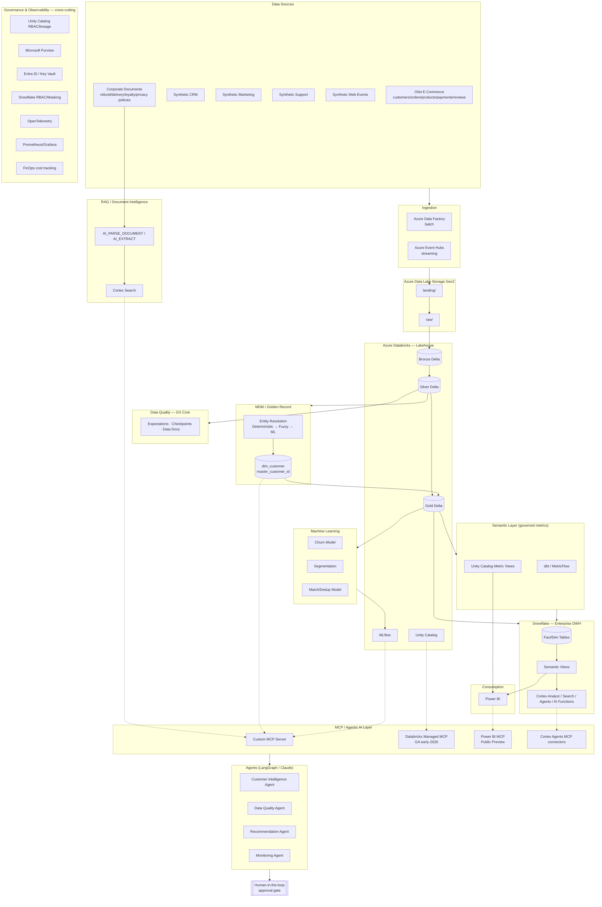

# Architecture

This document is the single source of truth for the platform's architecture. It consolidates and supersedes the three design iterations captured in [`rascunho.md`](rascunho.md) (kept in the repo as historical record — see [CHANGELOG.md](CHANGELOG.md)).

## Table of contents

1. [Design principles](#1-design-principles)
2. [Reference architecture](#2-reference-architecture)
3. [Tech stack rationale](#3-tech-stack-rationale)
4. [Layer 1 — Sources & Ingestion](#4-layer-1--sources--ingestion)
5. [Layer 2 — Data Lake (ADLS Gen2)](#5-layer-2--data-lake-adls-gen2)
6. [Layer 3 — Lakehouse (Azure Databricks)](#6-layer-3--lakehouse-azure-databricks)
7. [Layer 4 — Data Quality](#7-layer-4--data-quality)
8. [Layer 5 — MDM / Golden Record](#8-layer-5--mdm--golden-record)
9. [Layer 6 — Customer Graph](#9-layer-6--customer-graph)
10. [Layer 7 — Machine Learning](#10-layer-7--machine-learning)
11. [Layer 8 — Semantic Layer (three implementations, one contract)](#11-layer-8--semantic-layer-three-implementations-one-contract)
12. [Layer 9 — Snowflake (Enterprise DWH + Cortex)](#12-layer-9--snowflake-enterprise-dwh--cortex)
13. [Layer 10 — Power BI](#13-layer-10--power-bi)
14. [Layer 11 — RAG / Document Intelligence](#14-layer-11--rag--document-intelligence)
15. [Layer 12 — MCP & Agentic AI](#15-layer-12--mcp--agentic-ai)
16. [Layer 13 — Governance & Security](#16-layer-13--governance--security)
17. [Layer 14 — Observability & FinOps](#17-layer-14--observability--finops)
18. [Layer 15 — Infrastructure as Code](#18-layer-15--infrastructure-as-code)
19. [Cloud portability (AWS)](#19-cloud-portability-aws)
20. [Repository structure](#20-repository-structure)
21. [Production readiness / honesty note](#21-production-readiness--honesty-note)

---

## 1. Design principles

1. **Every tool solves one named problem.** If a technology can't be justified as "this layer needs X because Y," it doesn't go in.
2. **One metric, one definition.** No dashboard and no agent is allowed to compute "Revenue" its own way — everything reads from a governed semantic layer.
3. **Human-in-the-loop for anything consequential.** No agent auto-executes merges, refunds, or retention offers — it recommends, with confidence and evidence, and a human approves.
4. **Data quality is measured, not assumed.** The platform reports its own trustworthiness (DQ score) as a first-class metric, not an afterthought.
5. **Cloud-primary, not cloud-locked.** Azure + Databricks is the implementation target (matches the roles this project targets); AWS equivalents are documented, not duplicated, based on hands-on AWS experience.
6. **Local-first development.** Everything below the cloud line in §2 can be developed and demoed with Docker/MinIO/Postgres before a single cloud resource is provisioned — see [docs/deployment.md](docs/deployment.md).

## 2. Reference architecture



## 3. Tech stack rationale

| Tool | Problem it solves | Alternative considered | Why not the alternative |
|---|---|---|---|
| **ADLS Gen2** | Cheap, durable, hierarchical raw storage | AWS S3 | Not used as primary because the target roles/JDs ask for Azure; documented as portability target instead |
| **Azure Data Factory + Event Hubs** | Managed batch + streaming ingestion without custom infra | Airflow self-hosted | ADF integrates natively with Databricks/Key Vault/Purview; Airflow adds ops burden without adding a skill this project needs to prove |
| **Azure Databricks + Delta Lake** | Distributed processing, ACID on the lake, Medallion architecture | Spark on EMR/Synapse | Databricks is the specific skill the target roles ask for; Delta gives transactions + time travel out of the box |
| **Unity Catalog** | Single governance plane for tables, models, functions, lineage | Hive Metastore + custom ACLs | UC is the current Databricks governance standard and unifies data + AI governance |
| **Great Expectations (GX Core)** | Declarative, testable data quality rules with generated documentation | Custom `assert` scripts | GX gives typed Expectations, Data Docs, and Checkpoint automation for free |
| **MDM (custom entity resolution)** | No off-the-shelf MDM tool fits a portfolio budget; also *the point* is demonstrating this skill | Reltio / Informix MDM (SaaS) | Enterprise MDM tools are commercial-licensed; building it demonstrates the underlying technique instead of hiding it behind a vendor |
| **MLflow** | Experiment tracking + model registry | Weights & Biases | MLflow ships built into Databricks — one less integration to maintain |
| **Snowflake** | Governed enterprise DWH + AI serving layer (Cortex) | Databricks SQL Warehouse only | Demonstrates Lakehouse **and** Warehouse competency, and Cortex Analyst/Agents are currently GA and interview-relevant |
| **dbt / MetricFlow** | Portable, git-versioned metric definitions (Apache 2.0, open-sourced late 2025) | Hand-written SQL views | MetricFlow guarantees one metric = one definition regardless of query grain |
| **Unity Catalog Metric Views** | Native, governed metric layer inside the Lakehouse (GA Apr/2026) | — | New capability; documented as an alternative to dbt for teams that want metrics to live where Databricks Genie can consume them directly |
| **Snowflake Semantic Views** | Metric/entity layer that feeds Cortex Analyst directly | dbt metrics exposed via view | Semantic Views are Snowflake's recommended grounding source for Cortex Analyst as of 2026 |
| **Power BI** | Enterprise BI for human consumers | Looker/Tableau | Matches the target job market (Brazil enterprise + Microsoft shops) |
| **LangGraph + Azure OpenAI** | Multi-step, stateful agent orchestration | Plain function-calling loop | LangGraph gives explicit state machines — needed for the human-in-the-loop gate |
| **MCP (Model Context Protocol)** | Standard interface between agents and tools/data, instead of a bespoke chatbot-to-SQL hack | Direct SQL execution from the LLM | MCP is the emerging industry standard (Databricks Managed MCP reached GA in 2026; Power BI MCP is in Public Preview) — using it is itself the differentiator |
| **Terraform (3 providers)** | Declarative, destroy/recreate infra | ClickOps / ARM templates only | Demonstrates IaC across three different providers (azurerm, databricks, Snowflake) in one coherent codebase |
| **OpenTelemetry + Prometheus + Grafana** | Vendor-neutral tracing/metrics across pipeline, ML, LLM and MCP calls | Cloud-native monitoring only (Azure Monitor) | OTel keeps the observability layer portable across the documented AWS target too |
| **Crawl4AI** | Local-dev ingestion of live web content into the RAG pipeline without a per-site headless-browser script | `AI_PARSE_DOCUMENT` web-ingestion connectors | Requires a paid Snowflake account; Crawl4AI gives the same "web page → clean Markdown" outcome for local development, per [ADR-011](docs/decisions/ADR-011-local-rag-stack.md) |
| **Docling** | Local-dev parsing of complex documents (tables, multi-column PDFs, DOCX) into layout-aware chunks | `AI_PARSE_DOCUMENT` / `AI_EXTRACT` | Same reasoning as Crawl4AI above — Docling is the local-first equivalent, not a replacement, of Snowflake's document parsing ([ADR-011](docs/decisions/ADR-011-local-rag-stack.md)) |
| **ChromaDB / FAISS** | Local vector store for RAG chunks and agent long-term memory | Cortex Search | Cortex Search remains the cloud/production retrieval index; ChromaDB (default, native metadata filtering) / FAISS (documented scale-out alternative) let the same pipeline run with zero Snowflake credentials locally ([ADR-011](docs/decisions/ADR-011-local-rag-stack.md)) |
| **LLM Gateway (multi-model router)** | Evaluated cost/latency/quality trade-off across LLM providers, instead of one hard-coded provider everywhere | Azure OpenAI only, called directly from every agent | A single `complete(prompt, task_type)` interface routes to Azure OpenAI/OpenAI/Gemini/DeepSeek (the latter three sharing one OpenAI-compatible HTTP client for three of them) based on an evaluated registry, not a hard-coded call site ([ADR-012](docs/decisions/ADR-012-llm-gateway-multimodel.md)) |
| **Agno** | Multi-tool autonomous agent for knowledge ingestion (choosing Crawl4AI vs. Docling vs. static read per source) | A second LangGraph agent | LangGraph is reserved for agents needing an explicit human-in-the-loop state machine (ADR-006); the Knowledge Ingestion Agent's job — autonomous tool selection across a fixed toolset — is exactly Agno's pattern, and using it demonstrates genuine framework breadth instead of a redundant LangGraph agent ([ADR-011](docs/decisions/ADR-011-local-rag-stack.md)) |

## 4. Layer 1 — Sources & Ingestion

**Sources:**
- **Olist Brazilian E-Commerce Public Dataset** (Kaggle, CC BY-NC-SA 4.0, real & anonymized) — `customers`, `orders`, `order_items`, `products`, `sellers`, `payments`, `reviews`, `geolocation`.
- **Synthetic CRM** (`crm_customers`) — ~100k rows, generated with `Faker` + a fixed seed, with **deliberately injected** data problems: 5% duplicate customers, 2% missing email, 1% invalid phone, 1% inconsistent address — see [DATA_MODEL.md §5](DATA_MODEL.md#5-synthetic-data-generation-strategy).
- **Synthetic Marketing** (`campaigns`, `campaign_interactions`) — ~200k interactions.
- **Synthetic Support** (`support_tickets`) — ~50k tickets with sentiment field.
- **Synthetic Web Events** (`web_events`) — ~1M clickstream events, used to demonstrate distributed processing.
- **Synthetic Finance/Payments** — reconciliation data.
- **Documents** — 4-5 synthetic corporate policy PDFs for RAG.

**Ingestion:** Azure Data Factory handles scheduled batch pulls (CRM/Marketing/Support exports, Olist CSV drop); Event Hubs simulates the web events stream. Both land raw, untouched, in `adls/landing/`.

## 5. Layer 2 — Data Lake (ADLS Gen2)

```
adls/
├── landing/       # freshly arrived, pre-validation
├── raw/           # exact copy of source, partitioned by ingestion date
│   ├── olist/  crm/  marketing/  support/  web/  finance/
├── bronze/        # Delta, minimal transformation (see Databricks layer)
├── silver/
├── gold/
├── quarantine/    # rows that fail Data Quality checks
├── checkpoints/   # streaming/incremental processing state
└── archive/       # cold historical data
```

Local-dev equivalent: **MinIO** exposing the same prefix structure, so `ingestion/` code is storage-agnostic (`abfss://` in cloud, `s3://`-compatible endpoint locally).

## 6. Layer 3 — Lakehouse (Azure Databricks)

Catalog: `customer_intelligence` · Schemas: `bronze`, `silver`, `gold`, `ml`, `monitoring`.

**Bronze** — near-exact copy of raw, Delta-ified, schema-on-read tolerant. Purpose: replay/audit. Tables: `bronze.olist_customers`, `bronze.olist_orders`, `bronze.crm_customers`, `bronze.marketing_events`, `bronze.support_tickets`, `bronze.web_events`.

**Silver** — normalization, deduplication (structural, not entity-level), type casting, NULL handling, schema enforcement, joins, standardization of name/email/phone/address/CPF-hash/city/state. Tables: `silver.customer`, `silver.order`, `silver.order_item`, `silver.product`, `silver.payment`, `silver.support`, `silver.web_event`.

**Gold** — business-ready, dimensional. See [DATA_MODEL.md §3](DATA_MODEL.md#3-gold-layer--dimensional-model).

**Orchestration:** Databricks Workflows + **Databricks Asset Bundles (DABs)** — reached GA in 2024 and renamed *Declarative Automation Bundles* in Mar/2026, still commonly called DABs — for declarative, git-versioned job/cluster/pipeline definitions deployed via CI/CD instead of manual notebook scheduling.

## 7. Layer 4 — Data Quality

Framework: **GX Core** (Great Expectations 1.0+, open source). Rules organized by dimension:

| Dimension | Examples |
|---|---|
| Completeness | `customer_id` NOT NULL, `email` completeness ≥ 95% |
| Validity | valid email/phone/date format, CPF-hash format |
| Uniqueness | `order_id` UNIQUE, duplicate-rate ≤ threshold |
| Referential integrity | `order.customer_id` EXISTS IN `customer.customer_id` |
| Freshness | max ingestion lag per source |
| Schema | column set/type drift detection |
| Volume anomaly | row-count deviation vs. rolling baseline |

Output: `quality_report.json` + published **GX Data Docs** (static HTML) + a `dq_score` per dataset, rolled up into an overall platform score consumed by the Data Quality Agent (§15) and the Power BI Data Quality dashboard.

Native Databricks Data Quality Monitoring (profiling + anomaly detection) is layered on top for continuous drift/freshness checks — GX owns declarative business rules, Databricks monitoring owns statistical drift.

## 8. Layer 5 — MDM / Golden Record

Three-tier Entity Resolution, matching the original design and validated with a labeled ground-truth benchmark (see [ROADMAP.md Sprint 5](ROADMAP.md)):

1. **Deterministic** — exact match on email, phone, or hashed document ID.
2. **Probabilistic / fuzzy** — Jaro-Winkler + Levenshtein similarity on name/address.
3. **ML-based** — Random Forest / Gradient Boosting classifier over `{name_similarity, email_similarity, phone_match, address_similarity, city_match, state_match}` → `match_probability`.

Decision bands: `≥0.90 → AUTO_MATCH` · `0.55–0.90 → HUMAN_REVIEW` · `<0.55 → DISTINCT`. Every merge produces an auditable **survivorship record** (which source record won which field, and why) — required for LGPD accountability, not present in the original draft.

Result: `gold.dim_customer` keyed by `master_customer_id`, a true Single Customer View.

## 9. Layer 6 — Customer Graph

`NetworkX` (local) with an optional `Neo4j` extension (documented, not required for the core). Nodes: `Customer, Email, Phone, Address, Order, Product, Seller`. Edges: `HAS_EMAIL, HAS_PHONE, LIVES_AT, PLACED, CONTAINS, SOLD_BY`. Computed metrics: degree, betweenness centrality, connected components, community detection — used to surface duplicate clusters and relationship anomalies the ML matcher alone would miss.

## 10. Layer 7 — Machine Learning

Three models, all tracked in **MLflow** (experiment → run → params/metrics/artifacts → Model Registry):

1. **Churn** — Logistic Regression / Random Forest / Gradient Boosting, compared on ROC-AUC, F1, Precision/Recall, PR-AUC, calibration.
2. **Segmentation** — KMeans over RFM + support/engagement features → `VIP / Loyal / Potential / At Risk / Inactive`.
3. **Match/Dedup** — feeds MDM (§8).

**Explainability:** SHAP for churn — every risk score ships with its top contributing features, not a bare probability.

## 11. Layer 8 — Semantic Layer (three implementations, one contract)

This is the most important upgrade over the original draft, informed by Aug/2026 research (see [IMPROVEMENTS_AND_RESEARCH.md](IMPROVEMENTS_AND_RESEARCH.md)): **there are now three legitimate ways to define governed metrics**, and the project deliberately implements all three — as a comparison exercise, not redundant work:

| Implementation | Where it lives | Best for |
|---|---|---|
| **dbt / MetricFlow** | Git, open-source (Apache 2.0), portable | Metric-as-code, engineer-owned, works with any warehouse |
| **Unity Catalog Metric Views** | Databricks-native (GA Apr/2026) | Consumed directly by Genie Agents / Databricks dashboards with zero export |
| **Snowflake Semantic Views** | Snowflake-native (GA Mar/2026) | Feeds Cortex Analyst directly, is the recommended grounding source for it |

One canonical definition (e.g. `Revenue = SUM(order_value) WHERE status = 'completed'`) is written once in [`docs/semantic-dictionary.md`](docs/semantic-dictionary.md) and mirrored into all three — this is exactly the discipline that prevents the *"Power BI said R$10M, the agent said R$13M"* failure mode described in the original draft. See [ADR-005](docs/decisions/ADR-005-semantic-layer.md).

## 12. Layer 9 — Snowflake (Enterprise DWH + Cortex)

Databases: `CUSTOMER_INTELLIGENCE` with schemas `RAW / STAGING / CORE / ANALYTICS / SEMANTIC / AI`. `CORE` holds the dimensional model (mirrors Databricks Gold). Incremental refresh from Databricks via **Streams + Tasks**.

**Cortex** (all GA as of the dates below — status corrected from the original draft's "Preview" assumption):
- **Cortex Analyst** (GA Nov 2025) — natural language → SQL over Semantic Views, with a published **REST API**.
- **Cortex Search** — retrieval over `AI_PARSE_DOCUMENT`/`AI_EXTRACT`-processed policy documents.
- **Cortex Agents** (GA Nov 2025) — orchestrates Analyst (structured) + Search (unstructured); MCP connectors added Apr 2026 for external tools (Jira/GitHub/Slack-class integrations, unused here but documented).
- **Cortex AI Guardrails** (GA May 2026) — applied to every agent response before it reaches a user, closing the AI-security gap the original draft never addressed.
- **AI Functions used**: `AI_PARSE_DOCUMENT`, `AI_EXTRACT`, `AI_SENTIMENT` (support tickets/reviews), `AI_EMBED` (RAG), `AI_REDACT` (PII masking on export).

**Evaluated, not assumed** — `snowflake/evaluations/` holds a golden-question set (`questions.csv` + `ground_truth.sql`), and every change to a Semantic View is regression-tested against it for SQL correctness, answer correctness and latency, mirroring Snowflake's own "verified queries" evaluation approach for Cortex Analyst.

## 13. Layer 10 — Power BI

Five report pages: **Executive Overview**, **Customer Intelligence** (RFM, CLV, churn), **Operations** (SLA/delivery), **Data Quality**, **Platform Observability** (pipeline health, DQ score, ML/LLM/MCP latency, cost). Sourced from Snowflake Semantic Views/UC Metric Views, never from raw Gold tables directly, to enforce the single-metric-definition rule.

**Power BI MCP** (remote + local, both Public Preview as of mid-2026 per Microsoft Learn) is wired up and documented as an **experimental/advanced integration**, not a load-bearing dependency of the core — matching the original draft's own caution, now confirmed by research.

## 14. Layer 11 — RAG / Document Intelligence

`refund_policy.pdf, delivery_policy.pdf, loyalty_policy.pdf, privacy_policy.pdf` (synthetic) → `AI_PARSE_DOCUMENT` → chunk → `AI_EMBED` → Cortex Search index → retrieval, combined at query time with customer/transaction data so the agent can answer e.g. *"Is this customer eligible for a refund?"* by joining policy text with order state.

### Local-first alternative (Crawl4AI + Docling + ChromaDB/FAISS)

[`rag/local_stack/`](rag/local_stack/) mirrors this pipeline stage-for-stage for local development, with zero Snowflake credentials required: **Crawl4AI** replaces the web-ingestion step (also enabling live-URL ingestion the static-PDF path doesn't cover), **Docling** replaces `AI_PARSE_DOCUMENT`/`AI_EXTRACT` for layout-aware local parsing, and **ChromaDB** (default) or **FAISS** (documented scale-out alternative) replaces Cortex Search as the local vector index. Cortex Search remains the cloud/production path — the local stack is a local-dev mirror of it, per the platform's local-first principle ([ADR-010](docs/decisions/ADR-010-local-first-development.md)). See [ADR-011](docs/decisions/ADR-011-local-rag-stack.md) for the full rationale, including the ChromaDB-vs-FAISS trade-off and why the new **Knowledge Ingestion Agent** (§15) is built with Agno instead of LangGraph.

## 15. Layer 12 — MCP & Agentic AI

**MCP servers wired in:**
- **Custom MCP server** (`mcp/server`) — tools: `get_customer`, `search_customers`, `get_customer_quality`, `get_customer_churn`, `get_customer_orders`, `get_customer_graph`, `get_sales_metrics`, `get_data_quality`, `get_model_metrics`, `get_pipeline_status`, `query_snowflake`, `recommend_action`.
- **Databricks Managed MCP** (Genie + Unity Catalog + AI Search + custom functions) — **GA since early 2026**; every tool call inherits the caller's Unity Catalog permissions natively.
- **Power BI MCP** — Public Preview, experimental integration only.
- **Cortex Agents** — consumed directly (not strictly MCP, but the same "agent queries governed semantic layer" pattern).

**Agents (LangGraph):**
1. **Customer Intelligence Agent** — orchestrator: intent detection → tool selection → data retrieval → validation → reasoning → response, choosing between Power BI MCP (simple metric lookups), Databricks/Cortex MCP (deeper analysis + ML), or Golden Record + Graph (identity questions).
2. **Data Quality Agent** — diagnoses DQ drops with root cause + affected row count + recommended action.
3. **Recommendation Agent** — combines churn score, CLV, support history and sentiment into a prioritized action, **always gated by human approval** before execution.
4. **Monitoring Agent** — watches pipeline/model/LLM health and raises alerts.

**AI security** (new — see [governance/security.md](governance/security.md) and [IMPROVEMENTS_AND_RESEARCH.md](IMPROVEMENTS_AND_RESEARCH.md)): every agent response passes through Cortex AI Guardrails; every MCP tool call is scoped to the minimum Unity Catalog / Snowflake role needed; prompt-injection test cases are part of the agent evaluation harness (`agents/*/evaluation/`).

### LLM Gateway, agent memory, and the Knowledge Ingestion Agent (Agno)

Three additions to the agentic layer, per [ADR-012](docs/decisions/ADR-012-llm-gateway-multimodel.md) and [ADR-013](docs/decisions/ADR-013-agent-memory.md):

- **LLM Gateway** ([`agents/llm_gateway/`](agents/llm_gateway/)) — a `complete(prompt, task_type)` router giving every agent access to Azure OpenAI, OpenAI, Gemini, or DeepSeek via one interface, selected per task type from an evaluated cost/latency/quality registry (`models.yaml`) instead of a hard-coded provider. Azure OpenAI remains the default for core reasoning; the gateway is what makes evaluating alternatives possible without rewriting agent code.
- **Agent memory** ([`agents/memory/`](agents/memory/)) — short-term (`short_term.py`, per conversation thread) and long-term (`long_term.py`, per `master_customer_id`, built on the same `VectorStore` abstraction as §14's local RAG stack) memory, both required to be traceable to a source interaction — consistent with the survivorship-log accountability standard already established for the Golden Record (§8, [governance/lgpd.md](governance/lgpd.md)).
- **Knowledge Ingestion Agent** ([`agents/knowledge_ingestion/`](agents/knowledge_ingestion/)) — an **Agno**-based agent (deliberately not LangGraph) that autonomously chooses which extraction tool (Crawl4AI, Docling, or a static read) a given knowledge source needs, then writes the result into the local RAG vector store. It never performs a customer-facing consequential action, so it doesn't need ADR-006's approval gate — a genuinely different responsibility from the four LangGraph agents above, not a duplicate.

## 16. Layer 13 — Governance & Security

- **Unity Catalog** — catalogs/schemas/tables/views/models/functions/volumes ACLs, lineage, audit.
- **Microsoft Purview** — connects to Unity Catalog metastore for cross-platform catalog/discovery/classification (documented limitations on lineage propagation).
- **Microsoft Entra ID + Key Vault + Managed Identity** — identity and secrets, no credentials in code/config ever.
- **Snowflake** — RBAC, warehouses-as-cost-boundaries, **masking policies** and **row-access policies** on PII columns (`email`, `phone`, `document_hash`), tag-based classification.
- **LGPD** — no real CPF/email/phone anywhere; synthetic data is explicitly labeled as such in every schema's docstring; `AI_REDACT` applied on any export path; full policy: [governance/lgpd.md](governance/lgpd.md).

## 17. Layer 14 — Observability & FinOps

**OpenTelemetry** traces spanning pipeline → ML → LLM → MCP → API calls, exported to **Prometheus**, visualized in **Grafana** (`pipeline_duration`, `rows_processed`, `dq_score`, `ml_latency`, `agent_latency`, `mcp_calls`, `llm_tokens`). **FinOps** dashboard tracks Databricks DBU, Snowflake credits, storage, LLM token cost, Power BI capacity — cost-per-1M-records and cost-per-agent-request are tracked as first-class metrics, not an afterthought.

## 18. Layer 15 — Infrastructure as Code

Terraform, three provider domains, structured as `environments/{dev,staging,prod}` + `modules/{azure,databricks,snowflake}`:

- **azurerm** — Resource Groups, ADLS Gen2, Data Factory, Event Hubs, Key Vault, networking, Azure OpenAI, Monitor.
- **databricks** (official Databricks provider) — workspace, clusters, jobs (via DABs where possible), Unity Catalog objects, permissions.
- **Snowflake** — the project targets the newer **`snowflakedb/snowflake`** provider where a resource is available there, falling back to **`Snowflake-Labs/snowflake` v1** (with `preview_features_enabled` explicitly declared per-resource) for anything not yet migrated — a nuance the original draft did not know to flag. See [ADR-008](docs/decisions/ADR-008-terraform-providers.md).

CI/CD (GitHub Actions): lint → unit tests → data tests (GX) → dbt tests → `terraform plan` (on PR) → build → security scan → `terraform apply` (on merge, environment-gated).

## 19. Cloud portability (AWS)

Documented, not duplicated — see [`cloud/architecture-comparison.md`](cloud/architecture-comparison.md):

| Azure | AWS |
|---|---|
| ADLS Gen2 | S3 |
| Data Factory / Event Hubs | Glue + Step Functions / Kinesis |
| Azure Databricks | Databricks on AWS |
| Key Vault / Entra ID | Secrets Manager / IAM |
| Azure Monitor | CloudWatch |
| Azure OpenAI | Bedrock |
| Purview | Glue Catalog / Lake Formation |

## 20. Repository structure

```
enterprise-customer-intelligence-platform/
├── README.md · README-pt.md · ARCHITECTURE.md · ROADMAP.md · CHANGELOG.md
├── DATA_MODEL.md · IMPROVEMENTS_AND_RESEARCH.md · LICENSE
├── architecture/            # diagrams (drawio/png), this file's source of truth for visuals
├── data/                    # raw/, synthetic/{crm,marketing,support,web,finance}, documents/
├── ingestion/                # api/, olist/, files/, streaming/
├── databricks/               # notebooks/, jobs/, workflows/, sql/, unity_catalog/
├── lakehouse/                 # bronze/, silver/, gold/ (PySpark transform code)
├── data_quality/              # rules/, expectations/, validators/, monitoring/, reports/
├── mdm/                       # entity_resolution/, golden_record/, matching/, survivorship/
├── graph/                      # networkx/, algorithms/, queries/
├── ml/                          # features/, churn/, segmentation/, matching/, training/, evaluation/, explainability/
├── mlflow/
├── snowflake/                   # databases/, schemas/, warehouses/, roles/, grants/, semantic_views/, cortex/{analyst,search,agents,functions}/, evaluations/
├── dbt/                          # models/{staging,intermediate,marts}, tests/, macros/, snapshots/, seeds/
├── rag/                          # ingestion/, parsing/, embeddings/, retrieval/, evaluation/
├── agents/                       # orchestrator/, customer/, quality/, recommendation/, monitoring/
├── mcp/                          # server/, tools/, resources/, prompts/
├── powerbi/                      # semantic_model/, dax/, dashboards/, documentation/
├── api/                          # routes/, schemas/, services/, middleware/ (FastAPI)
├── monitoring/                   # prometheus/, grafana/, opentelemetry/, dashboards/
├── governance/                   # security.md, lgpd.md, pii.md, lineage.md, access_control.md, data_catalog.md
├── terraform/                    # environments/{dev,staging,prod}, modules/{azure,databricks,snowflake}, policies/
├── cloud/                        # azure/, aws/, architecture-comparison.md
├── benchmarks/                   # pipeline, DQ, ML, Cortex, agent, infra measurements
├── tests/                        # unit/, integration/, data/, ml/, ai/
├── docs/                         # data_dictionary.md, semantic-dictionary.md, deployment.md, runbooks/, decisions/ (ADRs)
├── versioning/                    # cross-cutting versioning policy + backup/disaster recovery (§21a)
│   └── backup/                    # RPO/RTO per component — ADLS, Delta, Snowflake, Terraform state, Key Vault
├── .github/workflows/            # ci.yml, data-quality.yml, dbt.yml, ml.yml, terraform.yml, security.yml
├── docker-compose.yml · Makefile · pyproject.toml · .env.example
```

Every top-level module ships its own `README.md` describing exactly what belongs there and which [ROADMAP.md](ROADMAP.md) sprint builds it.

## 21. Production readiness / honesty note

This is a portfolio project built to demonstrate architecture and hands-on implementation skill, not an actual bank's production system. "Production-like" in the readiness table (see [README.md §7](README.md#7-production-readiness)) means: the component is implemented with the same patterns, tooling and rigor (tests, IaC, monitoring, RBAC) a production system would use, at a scale appropriate for a personal project's cloud budget. Cloud components are provisioned on-demand via Terraform and torn down between demos to control cost — see [docs/deployment.md](docs/deployment.md).
