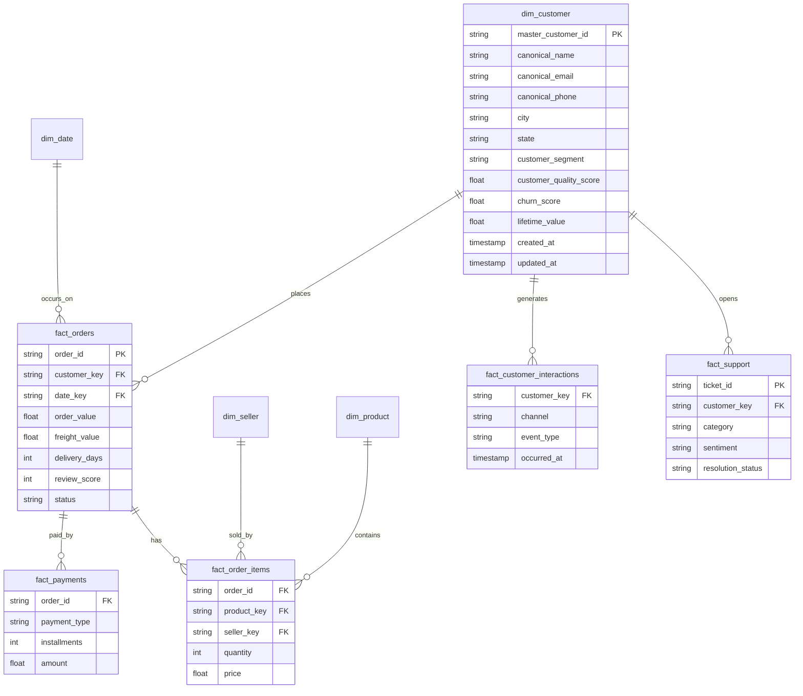

# Data Model

## 1. Datasets — how to get them

### 1.1 Olist Brazilian E-Commerce Public Dataset (real, anonymized)

- **Source / download page:** https://www.kaggle.com/datasets/olistbr/brazilian-ecommerce
- **License:** CC BY-NC-SA 4.0 (non-commercial, attribution, share-alike) — respected here since this is a non-commercial portfolio project.
- **Size:** ~100k orders, 2016-2018, 9 relational CSV files (`olist_customers_dataset.csv`, `olist_orders_dataset.csv`, `olist_order_items_dataset.csv`, `olist_order_payments_dataset.csv`, `olist_order_reviews_dataset.csv`, `olist_products_dataset.csv`, `olist_sellers_dataset.csv`, `olist_geolocation_dataset.csv`, `product_category_name_translation.csv`).

**Download it — three ways, pick one:**

```bash
# Option A — Kaggle CLI (requires a free Kaggle account + API token in ~/.kaggle/kaggle.json)
pip install kaggle
kaggle datasets download -d olistbr/brazilian-ecommerce -p data/raw/olist --unzip

# Option B — kagglehub (no CLI config file needed, prompts for login on first run)
pip install kagglehub
python ingestion/olist/download.py

# Option C — manual
# 1. Go to https://www.kaggle.com/datasets/olistbr/brazilian-ecommerce
# 2. Click "Download" (top right) — requires a free Kaggle login
# 3. Unzip the archive into data/raw/olist/
```

The repo ships [`ingestion/olist/download.py`](ingestion/olist/download.py), which wraps Option B and is what `make seed` calls — see [README.md §9](README.md#9-getting-started-local-dev).

### 1.2 Synthetic sources (CRM, Marketing, Support, Web, Finance, Documents)

Generated locally — no download needed. Run:

```bash
python data/synthetic/generate_all.py --seed 42
```

This produces every synthetic CSV under `data/synthetic/` deterministically (same `--seed` → byte-identical output, so DQ/MDM results in this repo are reproducible run to run). See §5 for exactly what each generator produces and why. Implementation: [`data/synthetic/`](data/synthetic/).

### 1.3 One command for everything

```bash
make seed   # = python ingestion/olist/download.py && python data/synthetic/generate_all.py --seed 42
```

---

## 2. Bronze / Silver schemas (per source)

### Olist (Bronze → Silver: `silver.customer`, `silver.order`, `silver.order_item`, `silver.product`, `silver.payment`, `silver.review`)

Key Olist fields carried through: `customer_id`, `customer_unique_id`, `order_id`, `order_status`, `order_purchase_timestamp`, `order_delivered_customer_date`, `order_estimated_delivery_date`, `price`, `freight_value`, `payment_type`, `payment_installments`, `review_score`, `product_category_name`, `seller_id`, `customer_zip_code_prefix`, `customer_city`, `customer_state`.

### `crm_customers` (synthetic)

| Field | Type | Notes |
|---|---|---|
| `crm_customer_id` | string | source-system key |
| `name` | string | |
| `email` | string | nullable — 2% deliberately missing |
| `phone` | string | 1% deliberately invalid format |
| `document_hash` | string | SHA-256 of a fake CPF, never the raw value |
| `birth_date` | date | |
| `address`, `city`, `state` | string | 1% deliberately inconsistent city/state pairs |
| `created_at`, `updated_at` | timestamp | |

5% of rows are near-duplicates of another row (name variants, same email/phone) — this is the ground truth the MDM entity-resolution pipeline is scored against (`mdm/entity_resolution/evaluation/`).

### `campaigns` / `campaign_interactions` (synthetic marketing)

`campaign_id, name, channel, start_date, end_date, budget` / `customer_id, campaign_id, channel, impressions, clicks, conversion, cost, timestamp`.

### `support_tickets` (synthetic)

`ticket_id, customer_id, category, priority, sentiment, created_at, resolved_at, resolution_status`.

### `web_events` (synthetic, ~1M rows)

`session_id, customer_id, event_type, product_id, timestamp, device, browser, source, campaign` — sized to exercise distributed PySpark processing, not just pandas.

### Documents (synthetic, for RAG)

`refund_policy.pdf`, `delivery_policy.pdf`, `loyalty_policy.pdf`, `privacy_policy.pdf` — generated from Markdown templates in [`data/documents/templates/`](data/documents/templates/) and rendered to PDF by `data/documents/render.py`.

---

## 3. Gold layer — dimensional model



Reference DDL (Snowflake dialect, mirrored to Delta in `lakehouse/gold/`): [`snowflake/tables/`](snowflake/tables/).

## 4. Golden Record — survivorship rules

When multiple source records merge into one `master_customer_id`, field-level survivorship follows explicit, auditable rules (not "last write wins"):

| Field | Winning source priority | Rationale |
|---|---|---|
| `canonical_email` | CRM > Olist > Marketing | CRM is the system of record for contact data |
| `canonical_phone` | CRM > Support > Olist | same |
| `canonical_name` | Longest non-truncated value, title-cased | avoids picking an abbreviated variant |
| `city` / `state` | Most recent `updated_at` | address changes over time |

Every survivorship decision is logged to `mdm/golden_record/survivorship_log/` with `{master_customer_id, field, winning_source, losing_sources, rule_applied, timestamp}` — required for LGPD accountability and for explaining "why does the platform think this is the email?" during a demo.

## 5. Synthetic data generation strategy

- **Library:** `Faker` (locale `pt_BR`) for names/addresses/documents; `numpy`/`pandas` for numeric distributions.
- **Determinism:** every generator accepts `--seed`; default `42`. Same seed ⇒ identical output ⇒ reproducible DQ scores, MDM benchmark, and ML metrics across machines and CI runs.
- **Deliberate dirtiness** (so the pipeline has something real to fix): see table above per source. Percentages are configurable in [`data/synthetic/config.yaml`](data/synthetic/config.yaml), so a demo can show the DQ score respond to a `--dirty-rate` change live.
- **Volume knobs:** `--customers 100000 --web-events 1000000 --support-tickets 50000` (defaults shown) — scaled down automatically to `--profile local` (10k/50k/2k) so a laptop can run the full pipeline without a cluster; `--profile cloud` uses the full volumes on Databricks.
- **No real PII, ever:** documents are never real CPF/email/phone — this is asserted by a unit test (`tests/data/test_no_real_pii.py`) that scans generated files against a denylist of real-looking patterns before they're allowed to be committed as fixtures.

## 6. Data dictionary

Full column-by-column dictionary (source system, type, PII classification, masking policy applied): [`docs/data_dictionary.md`](docs/data_dictionary.md).
