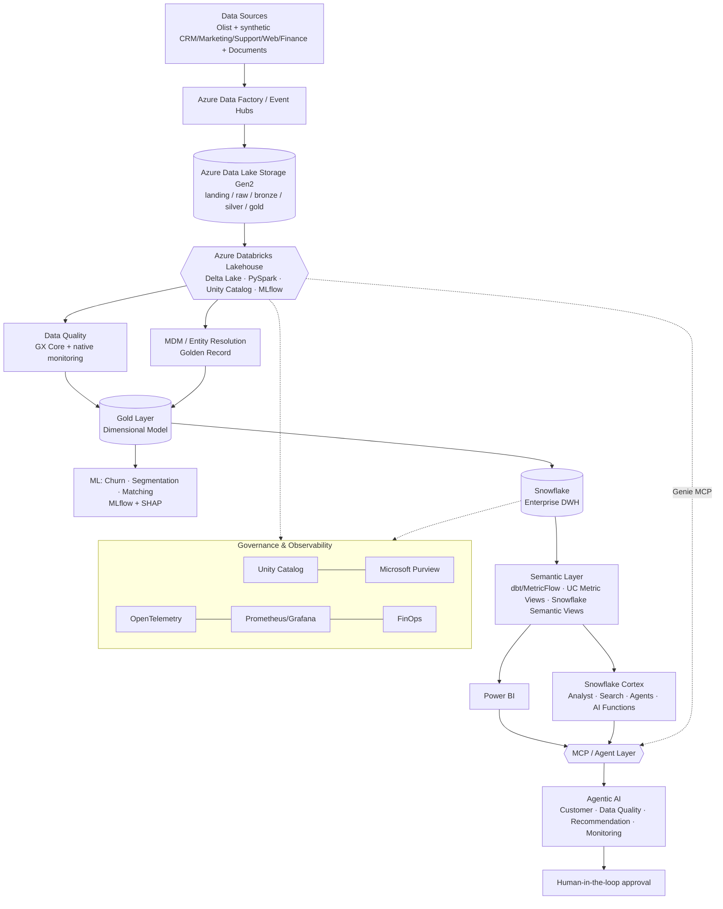

# Enterprise Customer Intelligence Platform

**Lakehouse · Data Warehouse · MDM · Machine Learning · Generative AI · MCP · Governance**

> A production-oriented, cloud-native Data & AI platform that turns fragmented, duplicated, low-trust customer data scattered across CRM, e-commerce, marketing, support and payment systems into a single governed **Golden Record**, exposes it through **governed metrics** (dbt/MetricFlow, Unity Catalog Metric Views, Snowflake Semantic Views), and lets both humans (Power BI) and AI agents (Snowflake Cortex, Databricks Genie, custom MCP tools, Claude) query, explain and act on it — with a human always in the loop for consequential decisions.

[]()
[]()
[]()

🇧🇷 Leia em português: [README-pt.md](README-pt.md)

---

## 1. The problem

A mid-size Brazilian e-commerce company has customer data spread across independent systems — online store, CRM, marketing automation, support desk, payments — each with its own idea of who a customer is. That produces:

- Duplicated customer records across systems
- Inconsistent metrics ("Revenue" means something different in every dashboard)
- No reliable way to detect churn, fraud clusters or VIP customers
- LLMs/agents answering questions with no trustworthy grounding
- Manual, ad-hoc dashboards that never agree with each other

This platform is the answer: a coherent, end-to-end architecture where **every technology exists to solve one specific, real problem** — not to pad a resume.

## 2. Architecture at a glance



Full layer-by-layer breakdown, diagrams and rationale: **[ARCHITECTURE.md](ARCHITECTURE.md)**.

## 3. Why Databricks *and* Snowflake?

They are not redundant — they own different responsibilities:

| Layer | Owns |
|---|---|
| **Azure Data Lake (ADLS Gen2)** | Raw, cheap, durable storage. Landing zone. |
| **Azure Databricks** | Lakehouse: ingestion, ETL/ELT, PySpark, Delta Lake, Bronze/Silver/Gold, MDM, feature engineering, ML training, MLflow. |
| **Snowflake** | Enterprise Data Warehouse: governed dimensional model, Semantic Views, Cortex (Analyst/Search/Agents/AI Functions) as the **AI serving layer**. |
| **Power BI** | Traditional enterprise BI for humans. |
| **MCP + Claude** | Agentic interface — the same governed data, queried in natural language by AI agents instead of dashboards. |

See [`docs/decisions/ADR-002-lakehouse-vs-warehouse.md`](docs/decisions/ADR-002-lakehouse-vs-warehouse.md) for the full trade-off analysis.

## 4. Tech stack

`Python` `PySpark` `Azure Data Factory` `Azure Databricks` `Delta Lake` `Unity Catalog` `MLflow` `dbt / MetricFlow` `Great Expectations (GX Core)` `Snowflake` `Snowflake Cortex (Analyst/Search/Agents/AI Functions)` `Power BI` `LangGraph` `Agno` `Azure OpenAI` `LLM Gateway (OpenAI/Gemini/DeepSeek)` `Crawl4AI` `Docling` `ChromaDB` `FAISS` `MCP (Model Context Protocol)` `FastAPI` `Terraform` `Docker` `GitHub Actions` `OpenTelemetry` `Prometheus` `Grafana` `NetworkX` — full rationale per tool in [ARCHITECTURE.md §3](ARCHITECTURE.md#3-tech-stack-rationale).

## 5. Repository structure

See the full annotated tree in [ARCHITECTURE.md §11](ARCHITECTURE.md#11-repository-structure). Every top-level module has its own `README.md` explaining its purpose and which sprint builds it.

## 6. Roadmap

Built in 16 sprints across 8 phases (Foundation → Data Engineering → MDM → Warehouse/BI → ML → GenAI/RAG → Agentic/MCP → Enterprise hardening). Full breakdown with epics, stories and acceptance criteria: **[ROADMAP.md](ROADMAP.md)**.

## 7. Production readiness

| Component | Status | Notes |
|---|---|---|
| Data Lake (ADLS) | Production-like | |
| Databricks Lakehouse (Delta/PySpark/UC) | Production-like | |
| Data Quality (GX Core) | Production-like | |
| MDM / Golden Record | Prototype → Production-like | ML-based matching validated with a labeled benchmark |
| ML (churn/segmentation) | Production-like | Tracked in MLflow Model Registry |
| Snowflake DWH + Semantic Views | Production-like | Semantic Views SQL querying reached GA Mar/2026 |
| Snowflake Cortex Analyst/Agents | Production-like | GA since Nov/2025 (Agents) and evaluated with a golden-question harness |
| Power BI | Production-like | |
| Power BI MCP | **Experimental** | Still Public Preview as of mid-2026 — see [IMPROVEMENTS_AND_RESEARCH.md](IMPROVEMENTS_AND_RESEARCH.md) |
| Databricks Managed MCP (Genie) | Production-like | Reached GA in early 2026 |
| Terraform (Azure/Databricks/Snowflake) | Production-like | |
| Agents (LangGraph, custom MCP) | Prototype → Production-like | Human-in-the-loop required for all write actions |
| Governance (Unity Catalog/Purview/LGPD) | Production-like | |

Full detail and what "production-like" means here (this is a portfolio project, not a bank's production system — see the honesty note): [ARCHITECTURE.md §10](ARCHITECTURE.md#10-production-readiness--honesty-note).

## 8. Datasets

- **Olist Brazilian E-Commerce Public Dataset** (real, anonymized, ~100k orders) — core transactional data.
- **Synthetic CRM / Marketing / Support / Web Events / Finance** — generated with reproducible seeds, deliberately containing duplicates, missing fields and inconsistencies to give the MDM/DQ pipeline something real to solve.
- **Synthetic corporate documents** (refund/delivery/loyalty/privacy policies) — feed RAG / Cortex Search.

Full schema and generation strategy: [DATA_MODEL.md](DATA_MODEL.md).

## 9. Getting started (local dev)

```bash
git clone <repo-url> && cd enterprise-customer-intelligence-platform
cp .env.example .env
make up        # docker-compose: MinIO, Postgres, MLflow, GX
make seed       # generates synthetic datasets
make test       # unit + data tests
```

Cloud components (Azure, Databricks, Snowflake, Power BI, Cortex) are opt-in via `terraform/environments/dev` and are **not required** to explore the local pipeline. See [docs/deployment.md](docs/deployment.md).

## 10. Documentation index

| Doc | Purpose |
|---|---|
| [ARCHITECTURE.md](ARCHITECTURE.md) | Full architecture, diagrams, tool rationale |
| [ROADMAP.md](ROADMAP.md) | Sprints, epics, stories, acceptance criteria |
| [CHANGELOG.md](CHANGELOG.md) | Version history of this specification |
| [DATA_MODEL.md](DATA_MODEL.md) | Datasets, schemas, dimensional model |
| [IMPROVEMENTS_AND_RESEARCH.md](IMPROVEMENTS_AND_RESEARCH.md) | Gaps found in the original design + Aug/2026 platform research (PT-BR) |
| [docs/decisions/](docs/decisions/) | ADRs (PT-BR) |
| [governance/](governance/), [governance/security.md](governance/security.md) | Governance & AI security model |

## 11. Author's note

This project demonstrates end-to-end ownership across Data Engineering (ETL/ELT, PySpark, Delta, dbt), Data Governance (MDM, Golden Record, lineage, RBAC, LGPD), Data Science/MLOps (feature engineering, MLflow, SHAP), and AI Engineering (RAG, agents, MCP, human-in-the-loop) — built on Azure/Databricks as the primary cloud, with AWS documented as a portability target based on hands-on experience with both.

## License

MIT — see [LICENSE](LICENSE). All data is either public/anonymized (Olist) or synthetically generated; no real PII is used anywhere in this repository.
