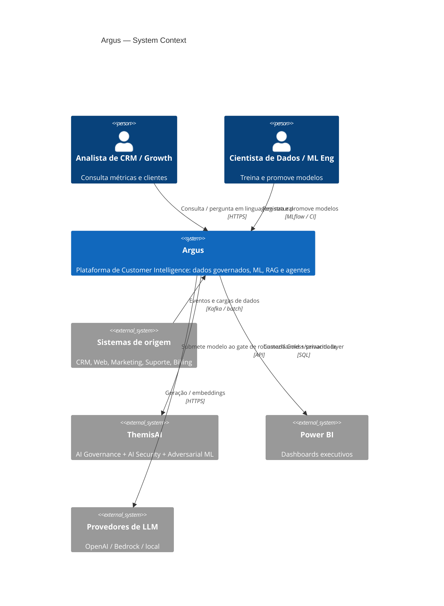

# C4 — Nível 1: Context

```mermaid
C4Context
title Argus — System Context

Person(analyst, "Analista de CRM / Growth", "Consulta métricas e clientes")
Person(ds, "Cientista de Dados / ML Eng", "Treina e promove modelos")

System(argus, "Argus", "Plataforma de Customer Intelligence: dados governados, ML, RAG e agentes")

System_Ext(sources, "Sistemas de origem", "CRM, Web, Marketing, Suporte, Billing")
System_Ext(themis, "ThemisAI", "AI Governance + AI Security + Adversarial ML")
System_Ext(bi, "Power BI", "Dashboards executivos")
System_Ext(llm, "Provedores de LLM", "OpenAI / Bedrock / local")

Rel(sources, argus, "Eventos e cargas de dados", "Kafka / batch")
Rel(analyst, argus, "Consulta / pergunta em linguagem natural", "HTTPS")
Rel(ds, argus, "Registra e promove modelos", "MLflow / CI")
Rel(argus, themis, "Submete modelo ao gate de robustez/fairness/privacidade", "API")
Rel(argus, bi, "Camada Gold + semantic layer", "SQL")
Rel(argus, llm, "Geração / embeddings", "HTTPS")
```
