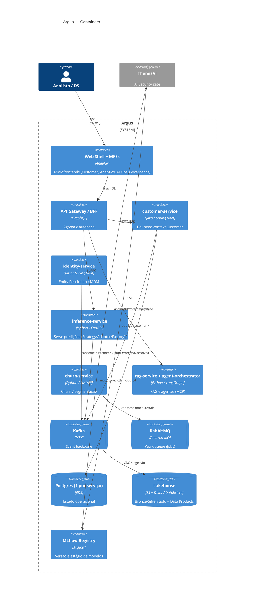

# C4 — Nível 2: Container

```mermaid
C4Container
title Argus — Containers

Person(user, "Analista / DS")

System_Boundary(argus, "Argus") {
  Container(web, "Web Shell + MFEs", "Angular", "Microfrontends (Customer, Analytics, AI Ops, Governance)")
  Container(bff, "API Gateway / BFF", "GraphQL", "Agrega e autentica")
  Container(customer, "customer-service", "Java / Spring Boot", "Bounded context Customer")
  Container(identity, "identity-service", "Java / Spring Boot", "Entity Resolution / MDM")
  Container(inference, "inference-service", "Python / FastAPI", "Serve predições (Strategy/Adapter/Factory)")
  Container(churn, "churn-service", "Python / FastAPI", "Churn / segmentação")
  Container(rag, "rag-service + agent-orchestrator", "Python / LangGraph", "RAG e agentes (MCP)")
  ContainerQueue(kafka, "Kafka", "MSK", "Event backbone")
  ContainerQueue(rabbit, "RabbitMQ", "Amazon MQ", "Work queue (jobs)")
  ContainerDb(pg, "Postgres (1 por serviço)", "RDS", "Estado operacional")
  ContainerDb(lake, "Lakehouse", "S3 + Delta / Databricks", "Bronze/Silver/Gold + Data Products")
  Container(mlflow, "MLflow Registry", "MLflow", "Versão e estágio de modelos")
}

System_Ext(themis, "ThemisAI", "AI Security gate")

Rel(user, web, "usa", "HTTPS")
Rel(web, bff, "GraphQL")
Rel(bff, customer, "REST/gRPC")
Rel(bff, inference, "gRPC")
Rel(bff, rag, "REST")
Rel(customer, kafka, "publica customer.*")
Rel(identity, kafka, "consome customer.* / publica identity.resolved")
Rel(inference, kafka, "publica model.prediction.created")
Rel(churn, rabbit, "consome model.retrain")
Rel(customer, pg, "lê/escreve")
Rel(kafka, lake, "CDC / ingestão")
Rel(mlflow, themis, "submete modelo ao gate")
Rel(themis, mlflow, "aprova/bloqueia promoção")
```
