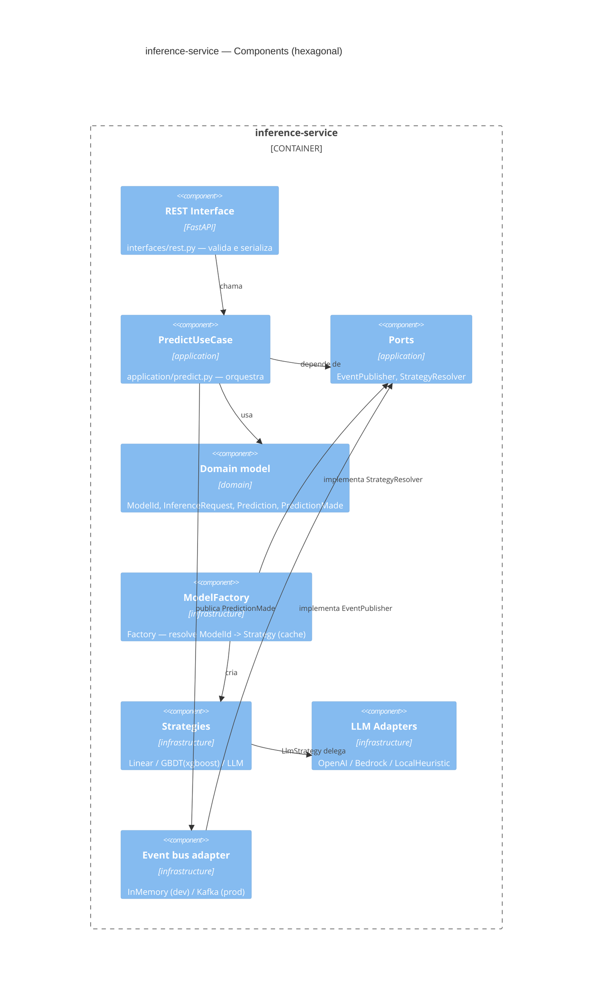

# C4 — Nível 3: Component (inference-service)

```mermaid
C4Component
title inference-service — Components (hexagonal)

Container_Boundary(svc, "inference-service") {
  Component(rest, "REST Interface", "FastAPI", "interfaces/rest.py — valida e serializa")
  Component(uc, "PredictUseCase", "application", "application/predict.py — orquestra")
  Component(ports, "Ports", "application", "EventPublisher, StrategyResolver")
  Component(domain, "Domain model", "domain", "ModelId, InferenceRequest, Prediction, PredictionMade")
  Component(factory, "ModelFactory", "infrastructure", "Factory — resolve ModelId -> Strategy (cache)")
  Component(strategies, "Strategies", "infrastructure", "Linear / GBDT(xgboost) / LLM")
  Component(adapters, "LLM Adapters", "infrastructure", "OpenAI / Bedrock / LocalHeuristic")
  Component(bus, "Event bus adapter", "infrastructure", "InMemory (dev) / Kafka (prod)")
}

Rel(rest, uc, "chama")
Rel(uc, ports, "depende de")
Rel(factory, ports, "implementa StrategyResolver")
Rel(bus, ports, "implementa EventPublisher")
Rel(uc, domain, "usa")
Rel(factory, strategies, "cria")
Rel(strategies, adapters, "LlmStrategy delega")
Rel(uc, bus, "publica PredictionMade")
```
